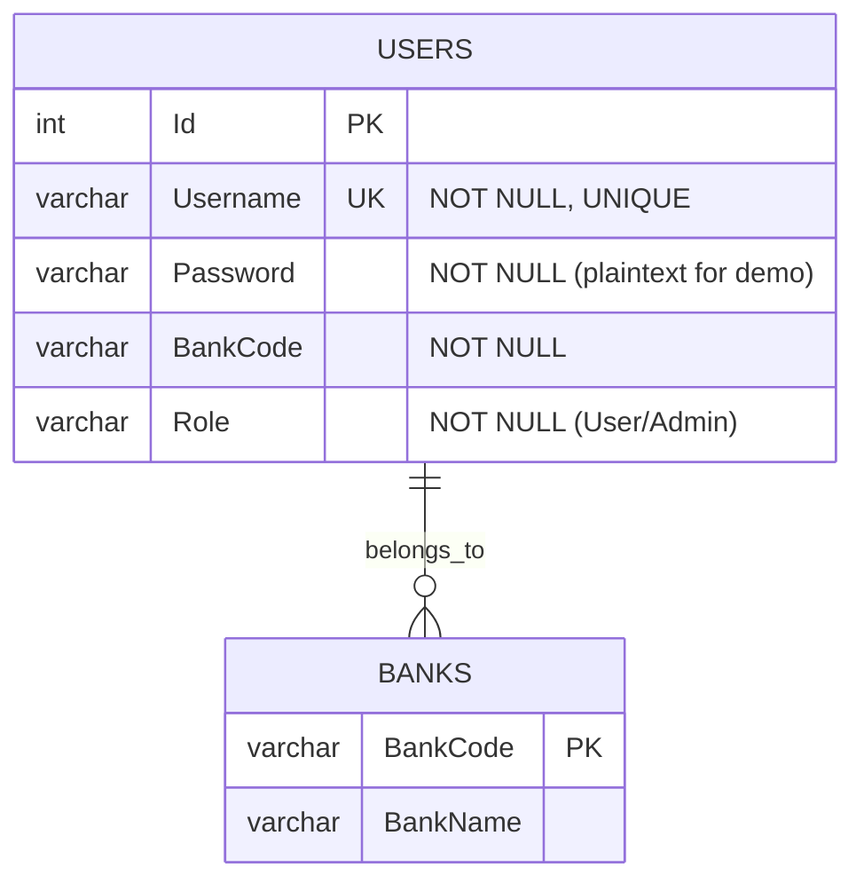

# ERD - Auth Service



## Table: Users

| Column | Type | Constraints | Description |
|--------|------|-------------|-------------|
| Id | INT | PRIMARY KEY, AUTO_INCREMENT | Unique user identifier |
| Username | VARCHAR(100) | NOT NULL, UNIQUE | Login username |
| Password | VARCHAR(100) | NOT NULL | Password (plaintext in demo) |
| BankCode | VARCHAR(10) | NOT NULL | Associated bank code |
| Role | VARCHAR(50) | NOT NULL | User role (User/Admin) |

## Seed Data

```sql
INSERT INTO Users (Id, Username, Password, BankCode, Role) VALUES
(1, 'user_banka', 'pass123', 'BANKA', 'User'),
(2, 'user_bankb', 'pass123', 'BANKB', 'User'),
(3, 'user_bankc', 'pass123', 'BANKC', 'User'),
(4, 'admin', 'admin123', 'NAPAS', 'Admin');
```

## Notes

- **Security**: Trong môi trường production, mật khẩu nên được mã hóa bằng BCrypt hoặc thuật toán tương tự
- **JWT**: Tokens bao gồm các claims Username, BankCode, và Role
- **Relationships**: Users thuộc về một ngân hàng thông qua BankCode
