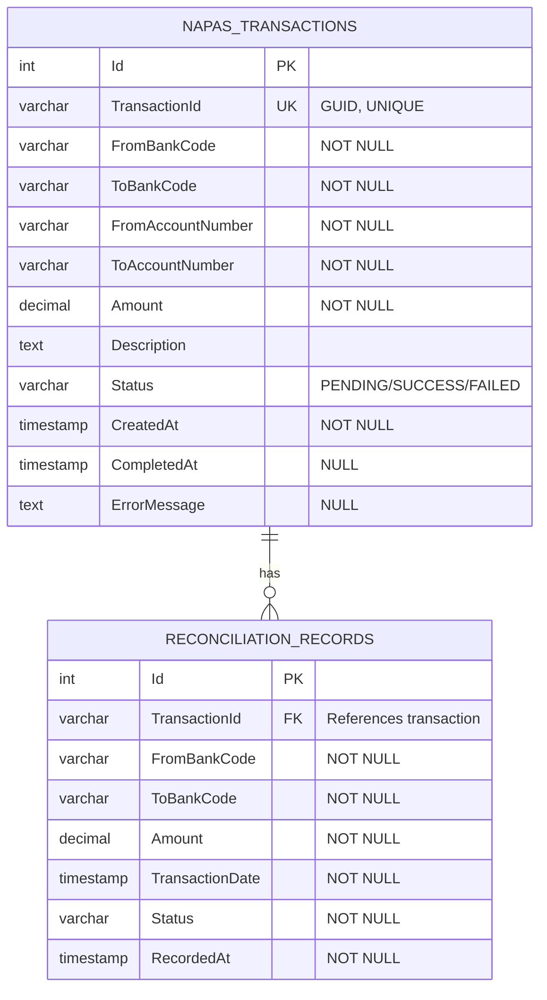

# ERD - NAPAS Service



## Table: NapasTransactions

| Column | Type | Constraints | Description |
|--------|------|-------------|-------------|
| Id | INT | PRIMARY KEY, AUTO_INCREMENT | Internal record ID |
| TransactionId | VARCHAR(100) | NOT NULL, UNIQUE | Global transaction identifier (GUID) |
| FromBankCode | VARCHAR(10) | NOT NULL | Source bank code |
| ToBankCode | VARCHAR(10) | NOT NULL | Destination bank code |
| FromAccountNumber | VARCHAR(50) | NOT NULL | Sender account number |
| ToAccountNumber | VARCHAR(50) | NOT NULL | Receiver account number |
| Amount | DECIMAL(18,2) | NOT NULL | Transfer amount |
| Description | TEXT | NULL | Transfer description |
| Status | VARCHAR(20) | NOT NULL | PENDING/SUCCESS/FAILED |
| CreatedAt | TIMESTAMP | NOT NULL | Transaction creation time |
| CompletedAt | TIMESTAMP | NULL | Transaction completion time |
| ErrorMessage | TEXT | NULL | Error details if failed |

## Table: ReconciliationRecords

| Column | Type | Constraints | Description |
|--------|------|-------------|-------------|
| Id | INT | PRIMARY KEY, AUTO_INCREMENT | Record ID |
| TransactionId | VARCHAR(100) | NOT NULL | References transaction |
| FromBankCode | VARCHAR(10) | NOT NULL | Source bank |
| ToBankCode | VARCHAR(10) | NOT NULL | Destination bank |
| Amount | DECIMAL(18,2) | NOT NULL | Settled amount |
| TransactionDate | TIMESTAMP | NOT NULL | Original transaction date |
| Status | VARCHAR(20) | NOT NULL | Final status |
| RecordedAt | TIMESTAMP | NOT NULL | Reconciliation record time |

## Indexes

```sql
CREATE UNIQUE INDEX idx_transaction_id ON NAPAS_TRANSACTIONS(TransactionId);
CREATE INDEX idx_status ON NAPAS_TRANSACTIONS(Status);
CREATE INDEX idx_created_at ON NAPAS_TRANSACTIONS(CreatedAt);
CREATE INDEX idx_from_bank ON NAPAS_TRANSACTIONS(FromBankCode);
CREATE INDEX idx_to_bank ON NAPAS_TRANSACTIONS(ToBankCode);
```

## Business Rules

1. Every interbank transfer creates a NapasTransaction record
2. Upon completion (SUCCESS/FAILED), a ReconciliationRecord is created
3. ReconciliationRecords are used for settlement between banks
4. NAPAS acts as a trusted third party maintaining complete audit trail
