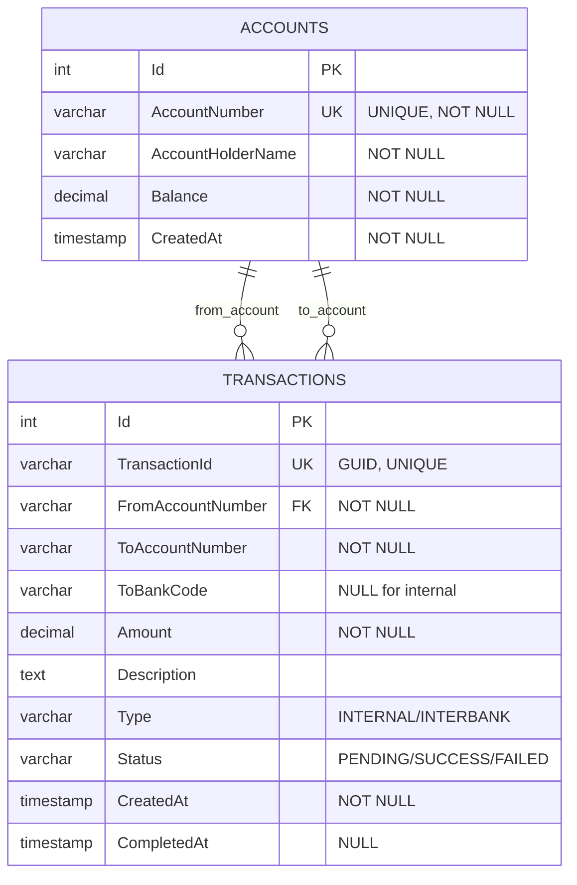

# ERD - Bank Service (A, B, C)



## Table: Accounts

| Column | Type | Constraints | Description |
|--------|------|-------------|-------------|
| Id | INT | PRIMARY KEY, AUTO_INCREMENT | Internal account ID |
| AccountNumber | VARCHAR(50) | NOT NULL, UNIQUE | Unique account identifier |
| AccountHolderName | VARCHAR(200) | NOT NULL | Customer name |
| Balance | DECIMAL(18,2) | NOT NULL | Current balance |
| CreatedAt | TIMESTAMP | NOT NULL | Account creation date |

## Table: Transactions

| Column | Type | Constraints | Description |
|--------|------|-------------|-------------|
| Id | INT | PRIMARY KEY, AUTO_INCREMENT | Transaction record ID |
| TransactionId | VARCHAR(100) | NOT NULL, UNIQUE | Global transaction ID (GUID) |
| FromAccountNumber | VARCHAR(50) | NOT NULL | Sender account |
| ToAccountNumber | VARCHAR(50) | NOT NULL | Receiver account |
| ToBankCode | VARCHAR(10) | NULL | Destination bank (NULL for internal) |
| Amount | DECIMAL(18,2) | NOT NULL | Transfer amount |
| Description | TEXT | NULL | Transfer description |
| Type | VARCHAR(20) | NOT NULL | INTERNAL or INTERBANK |
| Status | VARCHAR(20) | NOT NULL | PENDING/SUCCESS/FAILED |
| CreatedAt | TIMESTAMP | NOT NULL | Transaction start time |
| CompletedAt | TIMESTAMP | NULL | Transaction completion time |

## Seed Data - Bank A

```sql
INSERT INTO Accounts (Id, AccountNumber, AccountHolderName, Balance, CreatedAt) VALUES
(1, 'BANKA001', 'John Doe', 100000.00, NOW()),
(2, 'BANKA002', 'Jane Smith', 50000.00, NOW()),
(3, 'BANKA003', 'Bob Johnson', 75000.00, NOW());
```

## Seed Data - Bank B

```sql
INSERT INTO Accounts (Id, AccountNumber, AccountHolderName, Balance, CreatedAt) VALUES
(1, 'BANKB001', 'Alice Williams', 100000.00, NOW()),
(2, 'BANKB002', 'Charlie Brown', 50000.00, NOW()),
(3, 'BANKB003', 'Diana Prince', 75000.00, NOW());
```

## Seed Data - Bank C

```sql
INSERT INTO Accounts (Id, AccountNumber, AccountHolderName, Balance, CreatedAt) VALUES
(1, 'BANKC001', 'Eve Anderson', 100000.00, NOW()),
(2, 'BANKC002', 'Frank Miller', 50000.00, NOW()),
(3, 'BANKC003', 'Grace Lee', 75000.00, NOW());
```

## Indexes

```sql
CREATE UNIQUE INDEX idx_account_number ON ACCOUNTS(AccountNumber);
CREATE UNIQUE INDEX idx_transaction_id ON TRANSACTIONS(TransactionId);
CREATE INDEX idx_from_account ON TRANSACTIONS(FromAccountNumber);
CREATE INDEX idx_to_account ON TRANSACTIONS(ToAccountNumber);
CREATE INDEX idx_created_at ON TRANSACTIONS(CreatedAt);
CREATE INDEX idx_status ON TRANSACTIONS(Status);
```

## Quy tắc nghiệp vụ(Business Rules)

1. **Chuyển tiền nội bộ(Internal Transfer)**:
   - Cả hai tài khoản thuộc cùng một ngân hàng
   - ToBankCode is NULL
   - Type = "INTERNAL"
   - Status được đặt ngay lập tức thành SUCCESS
   - Balance được cập nhật trong một transaction duy nhất

2. **Chuyển tiền liên ngân hàng(Interbank Transfer)**:
   - Các tài khoản thuộc các ngân hàng khác nhau
   - ToBankCode is populated
   - Type = "INTERBANK"
   - Initial Status = PENDING
   - Balance của người gửi được trừ ngay lập tức
   - Balance của người nhận được cộng bất đồng bộ (asynchronously)
   - Status được cập nhật khi hoàn thành

3. **Ràng buộc (Constraints)**:
   - Balance không được âm
   - Amount phải là số dương
   - FromAccount và ToAccount phải tồn tại
   - Yêu cầu đủ số dư (sufficient balance) trước khi chuyển tiền
