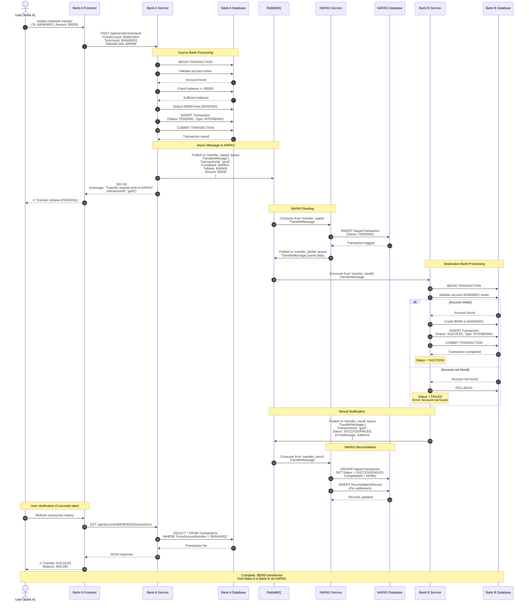

# Sequence Diagram - Interbank Transfer (24/7 Fast Transfer via NAPAS)

## Timeline (Tiến trình thời gian)

| Bước | Actor | Thời gian | Mô tả |
|------|-------|------|-------------|
| 1-8 | 🏦 Bank A | ~100ms | Xác thực và trừ tiền từ người gửi |
| 9 | 📬 RabbitMQ| ~10ms | Message được đưa vào hàng đợi tới NAPAS |
| 10 | 🚀 API | instant | Phản hồi cho người dùng |
| 11-13 | 🏢 NAPAS | ~50ms | Ghi log và định tuyến giao dịch |
| 14 | 📬 RabbitMQ | ~10ms | Message được đưa vào hàng đợi tới Bank B |
| 15-20 | 🏦 Bank B| ~100ms | Cộng tiền cho người nhận và lưu |
| 21 | 📬 RabbitMQ | ~10ms | Kết quả được đưa vào hàng đợi |
| 22-24 | 🏢 NAPAS | ~50ms | Cập nhật records và reconciliation |
| **⚡ Tổng** | | **~2-3 sec** | **Hoàn thành toàn bộ quá trình** |

## Các điểm chính (Key Points)

1. **Trừ tiền ngay lập tức (Immediate Deduction)**: Số dư người gửi được trừ ngay (ngăn chặn chi tiêu hai lần - prevents double-spending)
2. **Xử lý bất đồng bộ (Asynchronous Processing)**: Không chờ đợi (blocking wait) ngân hàng đích
3. **Theo dõi trạng thái (Status Tracking)**: PENDING → SUCCESS/FAILED
4. **Lưu trữ Message bền vững (Message Persistence)**: RabbitMQ đảm bảo không mất message
5. **Nhật ký kiểm toán (Audit Trail)**: Ghi nhận đầy đủ tại NAPAS để phục vụ reconciliation (đối soát)
6. **Xử lý lỗi (Error Handling)**: Giao dịch thất bại tạo ra error records
7. **Tính bất biến (Idempotency)**: TransactionId đảm bảo không xử lý trùng lặp

## Các kịch bản lỗi(Error Scenarios)

### Kịch bản 1: Tài khoản đích không tồn tại (Destination Account Not Found)
- Bank B trả về status FAILED
- Tiền người gửi đã bị trừ
- Yêu cầu hoàn tiền thủ công hoặc bồi thường tự động (automatic compensation)

### Kịch bản 2: Service Bank B bị down
- Message vẫn nằm trong queue 'transfer_bankb'
- Tự động retry (thử lại) khi service phục hồi
- Message chỉ được acknowledged (xác nhận) sau khi xử lý thành công

### Kịch bản 3: Lỗi mạng (Network Failure)
- RabbitMQ message persistence đảm bảo không mất dữ liệu
- Các message chưa được acknowledged sẽ được gửi lại (redelivered)
- Xử lý idempotent (bất biến) xử lý các duplicate (trùng lặp)
