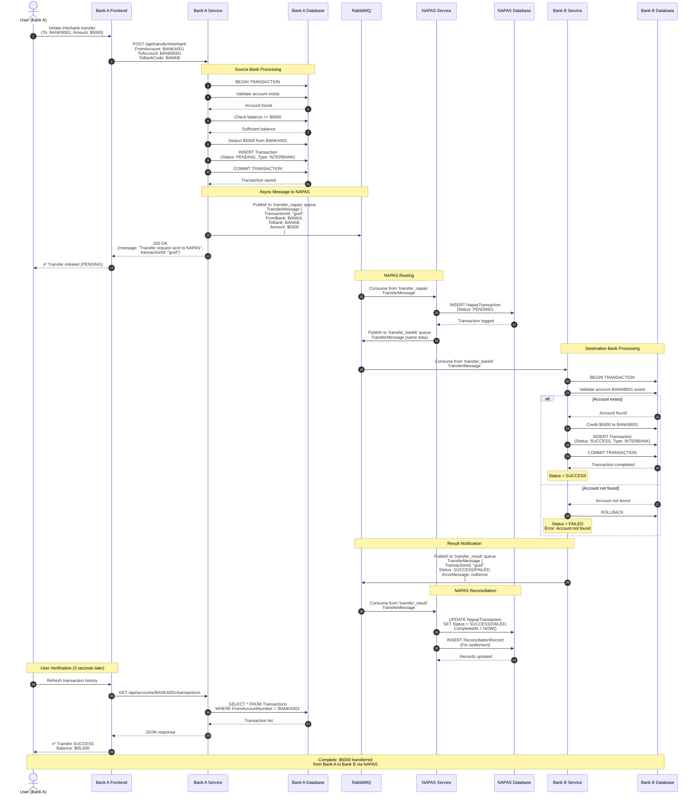

# Sequence Diagram - Interbank Transfer (24/7 Fast Transfer via NAPAS)

## Timeline

| Step | Actor | Time | Description |
|------|-------|------|-------------|
| 1-8 | Bank A | ~100ms | Validate and deduct from sender |
| 9 | RabbitMQ | ~10ms | Message queued to NAPAS |
| 10 | API | instant | Response to user |
| 11-13 | NAPAS | ~50ms | Log and route transaction |
| 14 | RabbitMQ | ~10ms | Message queued to Bank B |
| 15-20 | Bank B | ~100ms | Credit receiver and save |
| 21 | RabbitMQ | ~10ms | Result queued |
| 22-24 | NAPAS | ~50ms | Update records and reconciliation |
| **Total** | | **~2-3 sec** | **End-to-end completion** |

## Key Points

1. **Immediate Deduction**: Sender's balance reduced immediately (prevents double-spending)
2. **Asynchronous Processing**: No blocking wait for destination bank
3. **Status Tracking**: PENDING → SUCCESS/FAILED
4. **Message Persistence**: RabbitMQ ensures no message loss
5. **Audit Trail**: Complete record in NAPAS for reconciliation
6. **Error Handling**: Failed transfers create error records
7. **Idempotency**: TransactionId ensures no duplicate processing

## Error Scenarios

### Scenario 1: Destination Account Not Found
- Bank B returns FAILED status
- Sender money already deducted
- Requires manual refund or automatic compensation

### Scenario 2: Bank B Service Down
- Message stays in 'transfer_bankb' queue
- Automatic retry when service recovers
- Message acknowledged only after successful processing

### Scenario 3: Network Failure
- RabbitMQ message persistence ensures no loss
- Unacknowledged messages redelivered
- Idempotent processing handles duplicates
