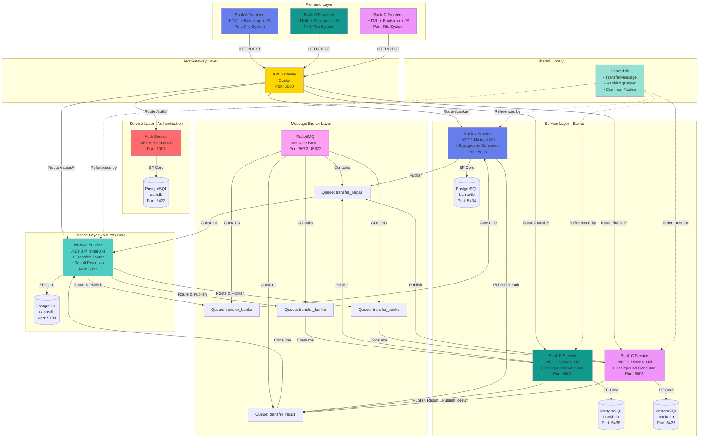

# System Architecture Overview - NAPAS 24/7 Fast Transfer Simulation



## Architecture Layers

### 1. Frontend Layer
- **Technology**: HTML5 + Bootstrap 5 + Vanilla JavaScript
- **Pattern**: Single Page Application (SPA)
- **Communication**: REST API via Fetch
- **Features**: Login, Account View, Transfers, Transaction History

### 2. API Gateway Layer
- **Technology**: Ocelot (ASP.NET Core)
- **Purpose**: Single entry point, routing, CORS
- **Pattern**: Gateway Aggregation
- **Port**: 5000

### 3. Service Layer
- **Technology**: .NET 8 Minimal APIs
- **Pattern**: Microservices Architecture
- **Database**: Database per Service
- **Communication**:
  - Synchronous: HTTP/REST
  - Asynchronous: RabbitMQ

### 4. Message Broker Layer
- **Technology**: RabbitMQ
- **Pattern**: Message Queue, Publish-Subscribe
- **Queues**: 5 durable queues with persistent messages
- **Purpose**: Async, decoupled, reliable communication

### 5. Data Layer
- **Technology**: PostgreSQL 15
- **Pattern**: Database per Service
- **ORM**: Entity Framework Core 8
- **Migration**: Code-First with automatic migrations

## Key Design Patterns

### 1. Microservices Pattern
- Each service is independently deployable
- Each service has its own database
- Services communicate via API and message queue

### 2. Database per Service
- Data isolation and independence
- Each service owns its data
- No direct database access between services

### 3. Event-Driven Architecture
- Asynchronous communication via messages
- Loose coupling between services
- Eventual consistency

### 4. API Gateway Pattern
- Single entry point for clients
- Request routing and aggregation
- Cross-cutting concerns (CORS, auth)

### 5. Background Service Pattern
- Long-running hosted services
- Message queue consumers
- Async processing

## Technology Stack

| Layer | Technology | Version | Purpose |
|-------|-----------|---------|---------|
| Backend | .NET | 8.0 | Microservices runtime |
| ORM | Entity Framework Core | 8.0 | Database abstraction |
| Database | PostgreSQL | 15 | Data persistence |
| Message Broker | RabbitMQ | 3.x | Async messaging |
| API Gateway | Ocelot | 23.4 | Request routing |
| Frontend | HTML/CSS/JS | - | User interface |
| UI Framework | Bootstrap | 5.3 | Responsive design |
| Container | Docker | - | Containerization |
| Orchestration | Docker Compose | - | Multi-container setup |

## Service Communication

### Synchronous (HTTP/REST)
- Frontend → API Gateway → Services
- Used for: Authentication, queries, internal transfers
- Response: Immediate (< 100ms)

### Asynchronous (RabbitMQ)
- Bank → NAPAS → Bank
- Used for: Interbank transfers
- Response: Eventual (2-3 seconds)

## Deployment Architecture

```
Docker Compose
├── 5 PostgreSQL containers
├── 1 RabbitMQ container
├── 6 .NET service containers
└── 1 Docker network (napas-network)
```

## Scalability Considerations

### Horizontal Scaling
- Multiple instances per service
- Load balancer in front of API Gateway
- Database read replicas

### Vertical Scaling
- Increase container resources
- Database optimization
- Connection pooling

### Message Queue Scaling
- RabbitMQ clustering
- Queue partitioning
- Consumer groups

## Security Architecture

### Current (Demo)
- Basic JWT authentication
- Plaintext passwords
- Open CORS policy
- HTTP only

### Production Required
- BCrypt password hashing
- HTTPS/TLS everywhere
- API rate limiting
- Input validation
- Secret management
- Database encryption
- Audit logging

## Monitoring & Observability

### Recommended Tools
- **Metrics**: Prometheus + Grafana
- **Logging**: Serilog + ELK Stack
- **Tracing**: OpenTelemetry + Jaeger
- **APM**: Application Insights
- **Alerts**: PagerDuty

## High Availability

### Database
- Master-slave replication
- Automatic failover
- Point-in-time recovery

### Services
- Multiple instances
- Health checks
- Circuit breakers
- Retry policies (Polly)

### Message Queue
- RabbitMQ clustering
- Persistent messages
- Dead letter queues
