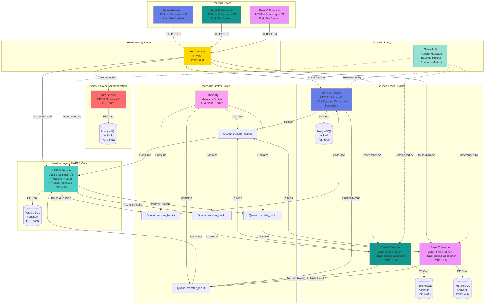

# Tổng Quan Kiến Trúc Hệ Thống - Mô Phỏng Chuyển Tiền Nhanh NAPAS 24/7



## Các tầng kiến trúc (Architecture Layers)

### 1. Tầng Frontend (Frontend Layer)
- **Công nghệ**: HTML5 + Bootstrap 5 + Vanilla JavaScript
- **Mẫu thiết kế (Pattern)**: Single Page Application (SPA)
- **Giao tiếp (Communication)**: REST API thông qua Fetch
- **Tính năng (Features)**: Đăng nhập, Xem tài khoản, Chuyển tiền, Lịch sử giao dịch

### 2. Tầng API Gateway (API Gateway Layer)
- **Công nghệ**: Ocelot (ASP.NET Core)
- **Mục đích (Purpose)**:  Điểm vào duy nhất, định tuyến (routing), CORS
- **Mẫu thiết kế**: Gateway Aggregation
- **Port**: 5000

### 3. Tầng Service (Service Layer)
- **Công nghệ**: .NET 8 Minimal APIs
- **Mẫu thiết kế**: Kiến trúc Microservices (Microservices Architecture)
- **Database**: Database per Service (Cơ sở dữ liệu riêng cho mỗi service)
- **Giao tiếp**:
  - Đồng bộ (Synchronous): HTTP/REST
  - Bất đồng bộ (Asynchronous): RabbitMQ

### 4. Tầng Message Broker (Message Broker Layer)
- **Công nghệ**: RabbitMQ
- **Mẫu thiết kế**: Message Queue, Publish-Subscribe
- **Queues**: 5 durable queues with persistent messages
- **Mục đích**: Giao tiếp async (bất đồng bộ), decoupled (tách biệt), đáng tin cậy (reliable)

### 5. Tầng Data (Data Layer)
- **Công nghệ**: PostgreSQL 15
- **Mẫu thiết kế**: Database per Service
- **ORM**: Entity Framework Core 8
- **Migration**: Code-First với automatic migrations (tự động migrate)

## Các mẫu thiết kế chính (Key Design Patterns)

### 1. Microservices Pattern
- Mỗi service có thể triển khai độc lập (independently deployable)
- Mỗi service sở hữu dữ liệu của riêng mình
- Các service giao tiếp qua API và message queue

### 2. Database per Service (Database riêng cho mỗi Service)
- Cô lập và độc lập dữ liệu (data isolation and independence)
- Each service owns its data
- Không truy cập trực tiếp database giữa các service

### 3. Event-Driven Architecture (Kiến trúc hướng sự kiện)
- Giao tiếp bất đồng bộ thông qua messages
- Loose coupling (liên kết lỏng lẻo) giữa các service
- Eventual consistency (tính nhất quán cuối cùng)

### 4. API Gateway Pattern
- Điểm vào duy nhất cho clients
- Định tuyến và tổng hợp request (request routing and aggregation)
- Xử lý các mối quan tâm chung (cross-cutting concerns): CORS, auth

### 5. Background Service Pattern
- Long-running hosted services
- Message queue consumers
- Xử lý bất đồng bộ (async processing)

## Technology Stack

| Tầng | Công nghệ | Phiên bản | Mục đích |
|-------|-----------|---------|---------|
| Backend | .NET | 8.0 | Microservices runtime |
| ORM | Entity Framework Core | 8.0 | Database abstraction (trừu tượng hóa DB) |
| Database | PostgreSQL | 15 | Data persistence (lưu trữ dữ liệu) |
| Message Broker | RabbitMQ | 3.x | Async messaging |
| API Gateway | Ocelot | 23.4 | Request routing (định tuyến request) |
| Frontend | HTML/CSS/JS | - | User interface |
| UI Framework | Bootstrap | 5.3 | Responsive design |
| Container | Docker | - | Containerization |
| Orchestration | Docker Compose | - | Multi-container setup |

## Giao tiếp giữa các Service (Service Communication)

### Đồng bộ (Synchronous - HTTP/REST)
- Frontend → API Gateway → Services
- Sử dụng cho: Authentication, queries (truy vấn), internal transfers
- Phản hồi (Response): Ngay lập tức (< 100ms)

### Bất đồng bộ (Asynchronous - RabbitMQ)
- Bank → NAPAS → Bank
- Sử dụng cho: Interbank transfers (chuyển tiền liên ngân hàng)
- Phản hồi: Cuối cùng (Eventual) (~2-3 giây)

## Kiến trúc triển khai (Deployment Architecture)

```
Docker Compose
├── 5 PostgreSQL containers
├── 1 RabbitMQ container
├── 6 .NET service containers
└── 1 Docker network (napas-network)
```

## Cân nhắc về khả năng mở rộng (Scalability Considerations)

### Mở rộng ngang (Horizontal Scaling)
- Nhiều instances cho mỗi service
- Load balancer đặt trước API Gateway
- Database read replicas (bản sao đọc)

### Mở rộng dọc (Vertical Scaling)
- Tăng tài nguyên container
- Tối ưu hóa database (database optimization)
- Connection pooling

### Mở rộng Message Queue (Message Queue Scaling)
- RabbitMQ clustering
- Queue partitioning (phân vùng queue)
- Consumer groups

## Kiến trúc bảo mật (Security Architecture)

### Hiện tại (Demo)
- JWT authentication cơ bản
- Mật khẩu plaintext (văn bản thuần)
- CORS policy mở
- Chỉ HTTP

### Yêu cầu cho Production (Production Required)
- BCrypt password hashing (mã hóa mật khẩu)
- HTTPS/TLS ở mọi nơi
- API rate limiting (giới hạn tốc độ)
- Input validation (xác thực đầu vào)
- Secret management (quản lý bí mật)
- Database encryption (mã hóa database)
- Audit logging (ghi log kiểm toán)

## Giám sát & Khả năng quan sát (Monitoring & Observability)

### Công cụ khuyến nghị (Recommended Tools)
- **Metrics (Số liệu)**: Prometheus + Grafana
- **Logging (Ghi log)**: Serilog + ELK Stack
- **Tracing (Truy vết)**: OpenTelemetry + Jaeger
- **APM (Application Performance Monitoring)**: Application Insights
- **Alerts (Cảnh báo)**: PagerDuty

## High Availability (Tính sẵn sàng cao)

### Database
- Master-slave replication (sao chép chủ-tớ)
- Automatic failover (chuyển đổi dự phòng tự động)
- Point-in-time recovery (khôi phục theo thời điểm)

### Services
- Multiple instances (nhiều instances)
- Health checks
- Circuit breakers (bộ ngắt mạch)
- Retry policies (chính sách thử lại) - Polly

### Message Queue
- RabbitMQ clustering
- Persistent messages (messages bền vững)
- Dead letter queues
