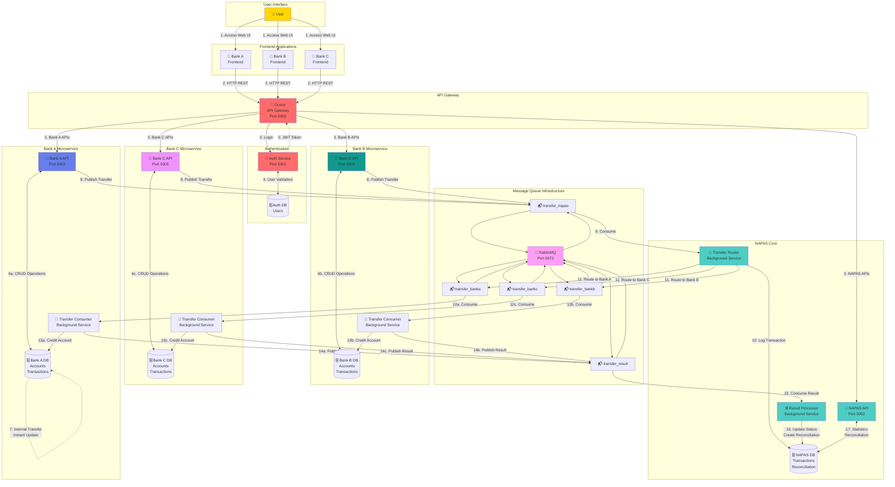

# Data Flow & Microservices Interaction Diagram



## Data Flow Scenarios

### Scenario 1: User Login
```
1. User opens Bank A frontend
2. Frontend → API Gateway → Auth Service
3. Auth Service validates credentials against Auth DB
4. Auth Service generates JWT token
5. Token returned to frontend
6. Frontend stores token for subsequent requests
```

### Scenario 2: View Account Balance
```
1. Frontend sends GET /api/accounts/BANKA001 (with JWT)
2. API Gateway routes to Bank A Service
3. Bank A Service queries Bank A Database
4. Account data returned through Gateway to Frontend
5. Frontend displays balance
```

### Scenario 3: Internal Transfer
```
1. Frontend sends POST /api/transfer/internal
2. API Gateway → Bank A Service
3. Bank A Service validates accounts and balance
4. Bank A Service updates both accounts in single transaction
5. Bank A Service saves transaction record (Status: SUCCESS)
6. Immediate response to user (< 100ms)
```

### Scenario 4: Interbank Transfer (Bank A → Bank B)
```
Step 1: Initiation (Bank A)
├── User submits transfer request
├── Bank A validates and deducts from sender
├── Bank A saves transaction (Status: PENDING)
└── Bank A publishes to transfer_napas queue

Step 2: Routing (NAPAS)
├── NAPAS Router consumes from transfer_napas
├── NAPAS logs transaction to NAPAS DB
├── NAPAS identifies destination bank (BANKB)
└── NAPAS publishes to transfer_bankb queue

Step 3: Processing (Bank B)
├── Bank B Consumer consumes from transfer_bankb
├── Bank B validates receiver account
├── Bank B credits receiver
├── Bank B saves transaction (Status: SUCCESS)
└── Bank B publishes result to transfer_result

Step 4: Reconciliation (NAPAS)
├── NAPAS Processor consumes from transfer_result
├── NAPAS updates transaction status
├── NAPAS creates reconciliation record
└── Transaction complete (Total: 2-3 seconds)
```

## Message Flow Patterns

### Pattern 1: Point-to-Point (Bank → NAPAS)
```
Publisher: Bank Service
Queue: transfer_napas
Consumer: NAPAS Router (single consumer)
Pattern: Work Queue
```

### Pattern 2: Routing (NAPAS → Specific Bank)
```
Publisher: NAPAS Router
Queue: transfer_banka / transfer_bankb / transfer_bankc
Consumer: Specific Bank Consumer
Pattern: Direct Exchange
```

### Pattern 3: Fanout (Result → NAPAS)
```
Publisher: Bank Services
Queue: transfer_result
Consumer: NAPAS Processor
Pattern: Work Queue with multiple publishers
```

## Data Consistency Models

### Strong Consistency (Internal Transfer)
- Single database transaction
- ACID properties guaranteed
- Immediate consistency
- Use case: Same-bank transfers

### Eventual Consistency (Interbank Transfer)
- Distributed transaction
- BASE properties (Basic Availability, Soft state, Eventual consistency)
- Asynchronous processing
- Use case: Cross-bank transfers

## Error Handling Flows

### Error Type 1: Validation Error
```
Request → Service validates → Returns 400 Bad Request
- No database changes
- Immediate response
- User corrects and retries
```

### Error Type 2: Insufficient Balance
```
Request → Service checks balance → Returns 400 Bad Request
- No database changes
- Immediate response
- User sees error message
```

### Error Type 3: Destination Account Not Found
```
Request → Bank A deducts → NAPAS routes → Bank B fails
- Bank A: Money deducted (PENDING)
- Bank B: Returns FAILED status
- NAPAS: Records failure
- Requires: Manual refund or auto-compensation
```

### Error Type 4: Service Unavailable
```
Request → Service down → Message queued
- RabbitMQ holds message
- Automatic retry when service recovers
- No message loss
```

## Performance Characteristics

| Operation | Latency | Consistency | Synchronous |
|-----------|---------|-------------|-------------|
| Login | 30-50ms | Strong | Yes |
| View Balance | 10-20ms | Strong | Yes |
| Internal Transfer | 50-100ms | Strong | Yes |
| Interbank Transfer (Initiate) | 100-200ms | Strong (sender) | Yes |
| Interbank Transfer (Complete) | 2-3 sec | Eventual | No |
| Transaction History | 20-50ms | Strong | Yes |
| Statistics | 50-100ms | Strong | Yes |

## Monitoring Points

### Application Metrics
- API request rate and latency
- Database query performance
- Message queue depth
- Consumer lag
- Error rates

### Infrastructure Metrics
- CPU and memory usage
- Network bandwidth
- Disk I/O
- Container health

### Business Metrics
- Total transactions
- Success rate
- Average transfer amount
- Peak usage times
- Daily/monthly volume

## Scalability Points

### Horizontal Scaling
- Add more service instances
- Load balance across instances
- Scale databases with read replicas

### Vertical Scaling
- Increase container resources
- Optimize database queries
- Add indexes

### Message Queue Scaling
- Add more consumers
- Partition queues
- Increase queue workers
