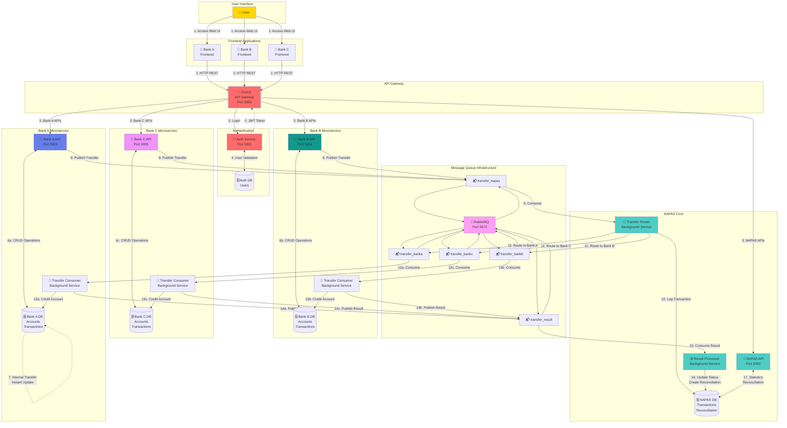

# SƠ ĐỒ LUỒNG DỮ LIỆU & TƯƠNG TÁC MICROSERVICES



## Các kịch bản luồng dữ liệu (Data Flow Scenarios)

### Kịch bản 1: Đăng nhập người dùng (User Login)
```
1. Người dùng mở frontend Bank A
2. Frontend → API Gateway → Auth Service
3. Auth Service xác thực thông tin đăng nhập với Auth DB
4. Auth Service tạo JWT token
5. Token returned to frontend
6. Frontend lưu token cho các request tiếp theo
```

### Kịch bản 2: Xem số dư tài khoản (View Account Balance)
```
1. Frontend gửi GET /api/accounts/BANKA001 (kèm JWT)
2. API Gateway định tuyến đến Bank A Service
3. Bank A Service truy vấn Bank A Database
4. Dữ liệu tài khoản được trả về qua Gateway đến Frontend
5. Frontend hiển thị số dư
```

### Kịch bản 3: Chuyển tiền nội bộ (Internal Transfer)
```
1. Frontend gửi POST /api/transfer/internal
2. API Gateway → Bank A Service
3. Bank A Service xác thực tài khoản và số dư
4. Bank A Service cập nhật cả hai tài khoản trong một transaction duy nhất
5. Bank A Service lưu bản ghi transaction (Status: SUCCESS)
6. Phản hồi ngay lập tức cho người dùng (< 100ms)
```

### Kịch bản 4: Chuyển tiền liên ngân hàng (Interbank Transfer) - Bank A → Bank B
```
Bước 1: Khởi tạo (Initiation) - Bank A
├── Người dùng gửi yêu cầu chuyển tiền
├── Bank A xác thực và trừ tiền từ người gửi
├── Bank A lưu transaction (Status: PENDING)
└── NAPAS publish message vào queue transfer_bankb

Bước 2: Định tuyến (Routing) - NAPAS
├── NAPAS Router consume message từ transfer_napas
├── NAPAS ghi log transaction vào NAPAS DB
├── NAPAS xác định ngân hàng đích (BANKB)
└── NAPAS publishes to transfer_bankb queue

Bước 3: Xử lý (Processing) - Bank B
├── Bank B Consumer consume message từ transfer_bankb
├── Bank B xác thực tài khoản người nhận
├── Bank B cộng tiền cho người nhận
├── Bank B lưu transaction (Status: SUCCESS)
└── Bank B publish kết quả vào transfer_result

Bước 4: Đối soát (Reconciliation) - NAPAS
├── NAPAS Processor consume message từ transfer_result
├── NAPAS cập nhật trạng thái transaction
├── NAPAS tạo reconciliation record
└── Giao dịch hoàn tất (Tổng: 2-3 giây)
```

## Các mẫu luồng Message (Message Flow Patterns)

### Pattern 1: Point-to-Point (Bank → NAPAS)
```
Publisher: Bank Service
Queue: transfer_napas
Consumer: NAPAS Router (single consumer)
Pattern: Work Queue
```

### Pattern 2: Routing (NAPAS → Specific Bank)
```
Publisher: NAPAS Router
Queue: transfer_banka / transfer_bankb / transfer_bankc
Consumer: Specific Bank Consumer
Pattern: Direct Exchange
```

### Pattern 3: Fanout (Result → NAPAS)
```
Publisher: Bank Services
Queue: transfer_result
Consumer: NAPAS Processor
Pattern: Work Queue with multiple publishers
```

## Mô hình nhất quán dữ liệu (Data Consistency Models)

### Strong Consistency (Nhất quán mạnh) - Internal Transfer
- Single database transaction
- Đảm bảo thuộc tính ACID
- Tính nhất quán ngay lập tức (immediate consistency)
- Use case: Chuyển tiền cùng ngân hàng

### Eventual Consistency (Nhất quán cuối cùng) - Interbank Transfer
- Distributed transaction
- BASE properties (Basic Availability, Soft state, Eventual consistency)
- Xử lý bất đồng bộ (asynchronous processing)
- Use case: Chuyển tiền liên ngân hàng

## Luồng xử lý lỗi (Error Handling Flows)

### Error Type 1: Lỗi xác thực (Validation Error)
```
Request → Service xác thực → Trả về 400 Bad Request
- Không có thay đổi database
- Phản hồi ngay lập tức
- Người dùng sửa và thử lại
```

### Error Type 2: Không đủ số dư (Insufficient Balance)
```
Request → Service kiểm tra số dư → Trả về 400 Bad Request
- Không có thay đổi database
- Phản hồi ngay lập tức
- Người dùng thấy thông báo lỗi
```

### Error Type 3: Không tìm thấy tài khoản đích (Destination Account Not Found)
```
Request → Bank A trừ tiền → NAPAS định tuyến → Bank B thất bại
- Bank A: Tiền đã trừ (PENDING)
- Bank B: Trả về status FAILED
- NAPAS: Ghi nhận thất bại
- Yêu cầu: Hoàn tiền thủ công hoặc bồi thường tự động (auto-compensation)
```

### Error Type 4: Service không khả dụng (Service Unavailable)
```
Request → Service down → Message queued
- RabbitMQ giữ message
- Tự động retry khi service phục hồi
- Không mất message
```

## Đặc tính hiệu năng (Performance Characteristics)

| Thao tác | Độ trễ (Latency) | Tính nhất quán (Consistency) | Đồng bộ |
|-----------|---------|-------------|-------------|
| Đăng nhập (Login) | 30-50ms | Strong | Yes |
| Xem số dư (View Balance) | 10-20ms | Strong | Yes |
| Chuyển tiền nội bộ (Internal Transfer) | 50-100ms | Strong | Yes |
| Chuyển tiền liên NH (Khởi tạo) | 100-200ms | Strong (sender) | Yes |
| Chuyển tiền liên NH (Hoàn tất) | 2-3 sec | Eventual | No |
| Lịch sử giao dịch (Transaction History)| 20-50ms | Strong | Yes |
| Thống kê (Statistics) | 50-100ms | Strong | Yes |

## Các điểm giám sát (Monitoring Points)

### Application Metrics (Số liệu ứng dụng)
- Tốc độ request API và độ trễ (API request rate and latency)
- Hiệu năng truy vấn database (database query performance)
- Độ sâu message queue (message queue depth)
- Consumer lag (độ trễ consumer)
- Tỷ lệ lỗi (error rates)

### Infrastructure Metrics (Số liệu hạ tầng)
- Sử dụng CPU và memory
- Băng thông mạng (network bandwidth)
- Disk I/O
- Sức khỏe container (container health)

### Business Metrics (Số liệu nghiệp vụ)
- Tổng số giao dịch (total transactions)
- Tỷ lệ thành công (success rate)
- Số tiền chuyển trung bình (average transfer amount)
- Thời điểm sử dụng cao điểm (peak usage times)
- Khối lượng hàng ngày/tháng (daily/monthly volume)

## Các điểm mở rộng (Scalability Points)

### Horizontal Scaling (Mở rộng ngang)
- Thêm nhiều service instances hơn
- Load balance trên các instances
- Mở rộng databases với read replicas

### Vertical Scaling (Mở rộng dọc)
- Tăng tài nguyên container
- Tối ưu hóa database queries
- Thêm indexes

### Message Queue Scaling (Mở rộng Message Queue)
- Thêm nhiều consumers hơn
- Phân vùng queues (partition queues)
- Tăng queue workers
